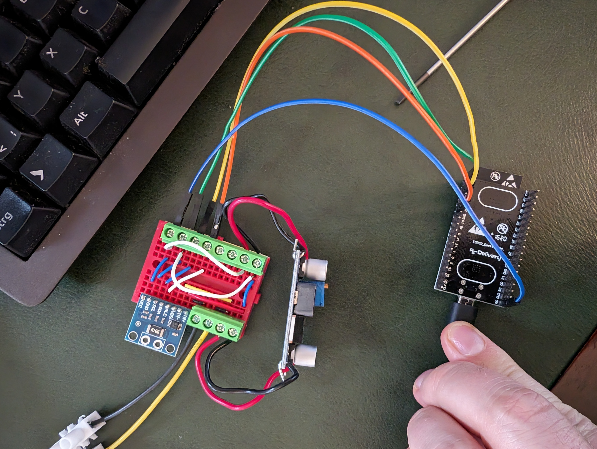
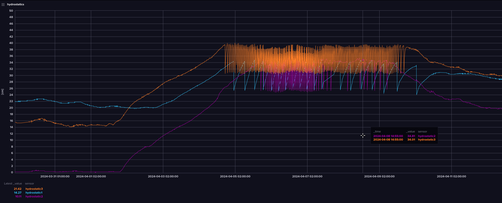
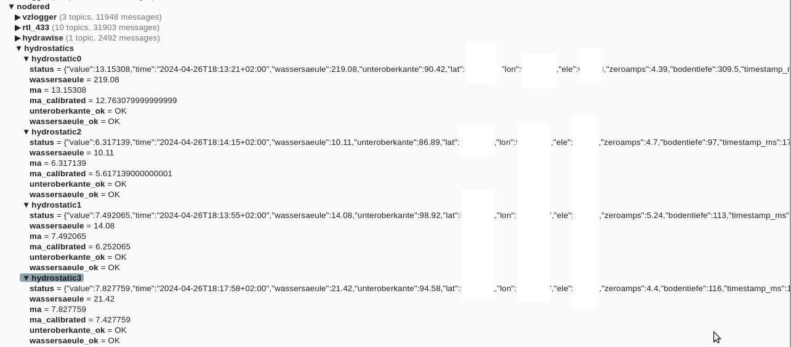
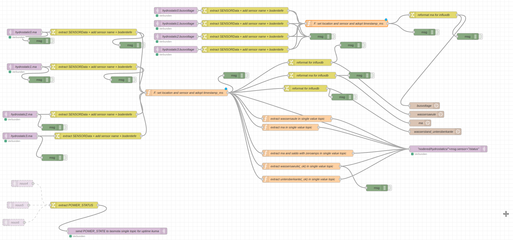
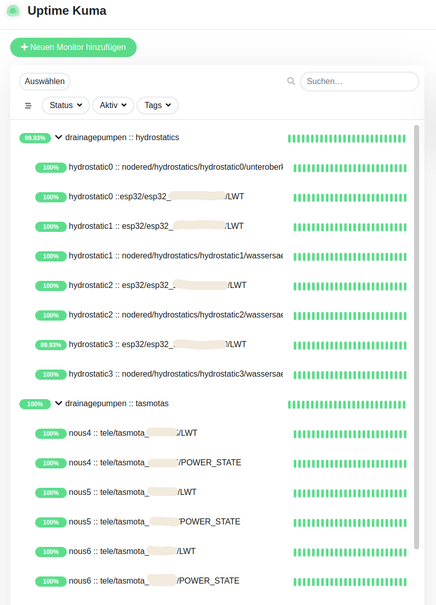

# Some esp32 micropython sensor projectbase

Project containing base-logic / configurable boilerplate for connecting sensors via esp32 via mqtt to nodered/whatever

## Description

Initial/Main project goal was to setup a device (or to be precise a couple of those) to be put in drainage 
systems in the field(s) to monitor the water-levels in the drainage system shafts and thus the proper functioning 
of the drainage pumps and their triggering.

## Getting Started

### Dependencies

#### hydrostatic water-level monitoring :: hardware / environment
  * hydrostatic water level sensor TL-136
  * esp32
  * INA226
  * XL6009 DC-DC boost converter (TL-136 wants 24V which will be created by this converter 
    from the voltage/current supplied by the esp32's voltage(regulator))
  * wiring / breadboard / soldering iron
  * waterproof box (used this one in the end: https://www.amazon.de/gp/product/B0751QPFKM)


#### software / environment
  * wifi
  * installed mqtt-server (we used a local mosquitto instance for that purpose)
  * not needed, but pretty much the sense of it all: installed monitoring solution (we chose uptime-kuma)
  * installed node-red (used for some data mapping for monitoring the levels in uptime-kuma and 
    normalizing data (also used for applying "calibration"-/offset-data gathered beforehand))
  * installed influxdb (used for storing data over time and also for displaying 
    metrics (i do not really like to configure grafana - which is of course a wonderful tool))

#### Notes
* Could also be adapted to be used via esp-now -> but that would need quite hefty (but manageable) adaption 
  in regards to the mqtt-logic
* nodered-screenshot does not contains flow for monitoring the power-draw/-usage by the pumps which are connected 
  via a tasmota-enabled switchable socket (nous-A1T)


### Installing

* install a fresh version of micropython on an esp32 with wifi capabilities 
* copy over all files found in this repo to the device
* either adapt esp32config.json or create a copy of esp32config.json named as esp32config.local.json and adapt settings therein such as:
  * wifi-networks credentials
  * mqtt-broker credentials
  * enable i2c and set pins appropriately
  * enable INA226 and set shunt and expected amps appropriately 
  * create proper logic in node red/monitoring in uptime-kuma

### Executing program

* since the code is placed in boot.py and main.py just booting/resetting the esp32 should make this work


## Authors

Contributors names and contact info

* This repo's owner
* Other people mentioned/credited in the files

## Version History

* -0.42
    * there will be no proper versioning
    * earlier versions used INA219, but INA226 seems to be 
      more accurate and can additionally/also monitor voltage on the high side whilst 
      monitoring current on the low side.
  

## License

This project is licensed under the LGPL where applicable/possible License - see the [LICENSE.md](LICENSE.md) file for details.
Some files/part of files could be governed by different/other licenses and/or licensors, 
such as (e.g., but not limited to) [MIT](LICENSEMIT.md) | [GPL](LICENSEGPL.md) | [LGPL](LICENSELGPL.md); so please also 
regard/pay attention to comments in regards to that throughout the codebase / files / part of files.

## Acknowledgments

Inspiration, code snippets, etc.
* please see comments in files for that


## some pictures of it
* [](media/53604859770_0842156e31_o_noexif.jpg)
* [](media/Bildschirmfoto_influxdb.png.png)
* [](media/Bildschirmfoto_mqtt_explorer.png)
* [](media/Bildschirmfoto_nodered.png)
* [](media/Bildschirmfoto_uptimekuma.png)


#### btw. removing (relevant) exif-data from jpg-files should be quite easy
* ```for i in *jpg ; do exif -o ${i%.jpg}_noexif.jpg --remove $i ; done```


## TODO
* could make it pull needed files from this repo based on actual enable config-options
* exception-handling // stacktrace-printing has a lot of duplicated code throughout the codebase
* use more subflows in nodered and not just copy-paste custom-nodes :slightly_frowning_face:
* provide (fritzing?!) wiring diagram maybe ?!
* make a 3d printed enclosure which better suits the circuitry (at the moment I just 
  threw that in an plastik bag into the outdoor-box)
* make a PCB


## "Bonus content"
### tasmota-rules used on the switchable socket
* ```{"Rule1":{"State":"ON","Once":"OFF","StopOnError":"OFF","Length":258,"Free":253,"Rules":"ON Time#Minute|5 DO BackLog WebQuery http://somehost.in.the.internet.de/ GET ENDON ON WebQuery#Data=Done DO Publish stat/tasmota_112233/CONNECTIVITY OK ENDON ON WebQuery#Data$!Done DO BackLog AP 0 ; Delay 400; Publish stat/tasmota_112233/CONNECTIVITY FAILED ENDON"}}```
* ```{"Rule2":{"State":"ON","Once":"OFF","StopOnError":"OFF","Length":313,"Free":198,"Rules":"ON Power1#state=1 DO var1 ON ENDON ON Power1#state=0 DO var1 OFF ENDON ON system#boot do Backlog Power1 ON; var1 ON; Publish2 tele/tasmota_112233/POWER_STATE %var1% ENDON ON Time#Minute|1 DO Publish2 tele/tasmota_112233/POWER_STATE %var1% ENDON on Energy#Power>0 do Publish tele/tasmota_112233/POWER %value% endon"}}```
* ```{"Rule3":{"State":"ON","Once":"ON","StopOnError":"OFF","Length":216,"Free":295,"Rules":"on Energy#Power>=10 do Publish tele/tasmota_112233/POWERTRIGGER 1 endon on Energy#Power<10 do Publish tele/tasmota_112233/POWERTRIGGER 0 endon on Energy#Power<=0.001 do Publish tele/tasmota_112233/POWER %value% endon"}}```
